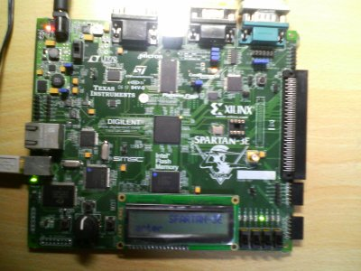
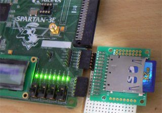
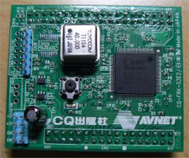
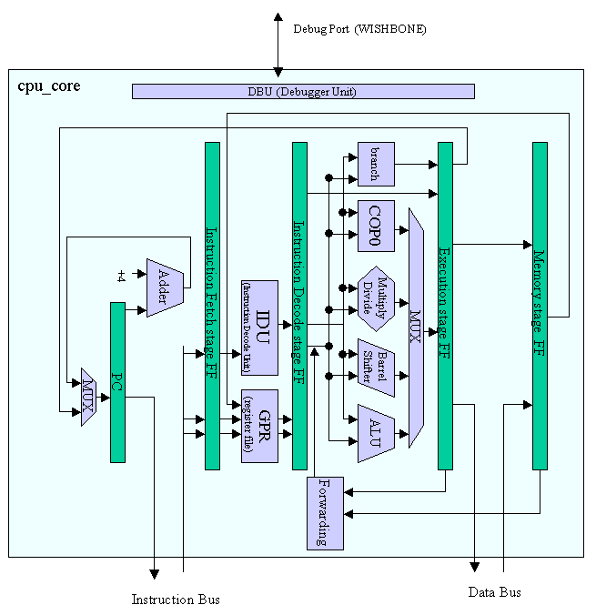
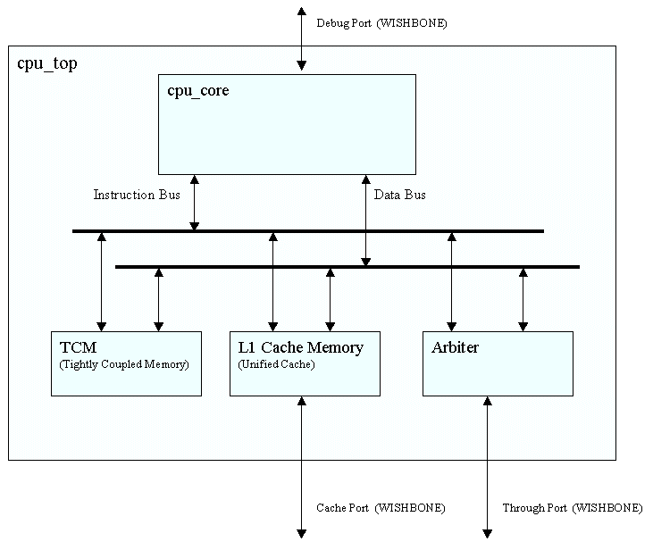

#  MIPS-I 互換ソフトコア環境

## はじめに

MicroBlazeが無償で利用でき、ZynqにARMコアが搭載され、今となっては過去の遺物となってしまっていますが、私が Jelly システムを作り始めたきっかけは「CPUを書いてみたい」が発端だったのと、今でも rtl/cpu フォルダの下に当時RTLを覚えたばかりの頃に書いたCPUのRTLコードが居座っていますので、当時 HTML で書いた説明文を今風に Markdown に書き直してみたいと思います。

## Jelly-CPUの特徴

- MIPS-Iライクな命令セットで、gcc でC言語開発が行える
- キャッシュ機能
- 密結合メモリ(TCM)機能
- Verilog 2001 で記述
- DDR-SDRAM対応
- μITRON4.0仕様 [HOS-V4a](https://github.com/ryuz/hos-v4a) 対応中
- ICE拡張用のデバッグポートを備えている
- キュメントが日本語(作者が英語わかんない)

## システムの説明

## CPUコアのブロック図

典型的な教科書どおり５段パイプラインのアーキテクチャで、コア部はハーバードアーキテクチャ(命令バスとデータバスが別)にしています。

また、内蔵でデバッグユニットも用意しており、外部からCPUコアを直接操作可能です。

フォワーディングも入っており、殆どの実行ユニットをEXステージに固めていますし、MIPS-Iではロード命令の次命令ではロードしたレジスタは利用禁止ですので、特にストルール要因はありません（なのでバスビジーなどでインターロックが必要なケースではプロセッサ全体をとめてしまい、機構をシンプル化しています）。

その他、FPGA的な工夫点としては、フォワーディングのマルチプレクサがFPGA的に苦手なので、特に32bit乗算でクリティカルパスとして現れます。そこで乗算命令の時でなく、結果の読み出し命令(mfhi, mflo)で乗算するようにして、見かけ上、乗算は1サイクルで実現できました(除算はさすがに32サイクルのインターロックがかかりますが)。

デバッグユニットのようなボトルネックを挟んで Spartan-3 のスピードグレード-4で50MHzで動いていますのでまあまあといったところではないでしょうか？

### CPUトップの説明図

CPUコアの外に、密結合メモリ(TCM)とキャッシュを搭載しています。TCMとキャッシュはオプションで切り離しも可能です。

FPGAの内蔵デュアルポートRAMを行かして、２つのポートを命令/データに割り当てているのでロス無くユニファイドキャッシュが実装できており、命令/データでのキャッシュコヒーレンシの問題も出ません。

密結合メモリ(TCM)もFPGAの内蔵デュアルポートRAMのおかげで、命令/データバスの両方からアクセスできます。

各種バスには[OPENCORES.ORG](http://www.opencores.org) の [WISHBONEバス](http://cdn.opencores.org/downloads/wbspec_b3.pdf) と互換性があるように作ったつもりです(単純なシングルアクセスしか使ってませんが)。

### Spartan3e statrer kit でのシステムの説明図

今回のボードにはRS-232Cが２ポートあるのをいいことに、デバッグポートはUART経由で制御するようにしています。パソコン側はUSBシリアルなどを買ってきて、増設すればどうにでもなります。ひとまず、プログラムダウンロードやレジスタ制御、ハードウェアブレークなど、将来デバッガ機能を一通り作れる機能を準備しています。

また、非常にシンプルなものですがDDR-SDRAMの制御RTLも書いてみました。IOの遅延調整がボード個体差があると思われますので、流用したい方でうまく動かない方はucfファイルの遅延値を調整してみてください。今のところシングルアクセスのみです。CPUの50MHzに対し、DDR-SDRAMは100MHz駆動なのでクロック乗せかえ用のブリッジが入っています。

ペリフェラルバスには各種周辺回路をつないでいます。IRC(割り込みコントローラ)はITRON屋らしく、多重割り込みや優先度設定が豊富にできるように工夫しています。本当はITRONのAPIをそのまま被せたかったのですが、回路的に無謀なのでそれなりにソフトウェア任せなところもあります。

## 開発環境について

### ハードウェア環境

開発ボードには Xilinx の Spartan-3e Starter Kitを使っていました。
今だと入手は難しいと思いますので、あくまで参考です。

### ソフトウェア環境

Xilinx の ISE WebPack を使っています。

C言語コンパイラは当時 gcc のクロスコンパイラを cygwin 上で構築して使っていました。今だと Windows 派の人でも WSL や VirtualBox がありますので Linux 上でクロスコンパイラが使えると思います。

swl,swr,lwl,lwr 等が使えないのでそこだけお気をつけください。

