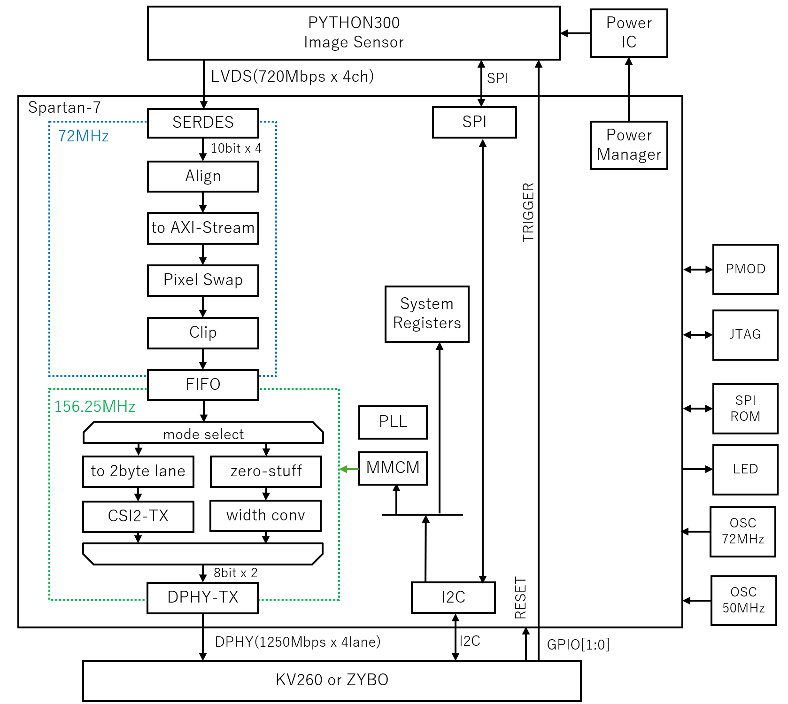

# PYTHON300 + Spartan7 センサー FPGAデザイン

## 概要

[グローバルシャッターMIPI高速度カメラ](https://rtc-lab.com/products/rtcl-cam-p3s7-mipi/)(設計は[こちら](https://github.com/ryuz/rtcl-p3s7-mipi))の Spartan-7 用のFPGAデザインです。

MIPI-CSI規格を利用せずに D-PHY 上に独自プロトコルで高速伝送することが可能です。
その際には画像1フレームを1パケットとして転送することで伝送帯域を有効に使い、高速度撮影を可能としています。

PYTHON300のデータシートはオンセミ社より[こちら](https://www.onsemi.jp/products/sensors/image-sensors/python300)で公開されているので、随時参照してください。

まだ試作段階で、今後まだ大きな変更が入る可能性がある点、ご了承ください。


## 環境

FPGAは Linux 版の Vivado 2023.2 で開発しておりますが、おそらく新しいバージョンでも大丈夫です。

JTAGダウンロードケーブルは、Digilent社の[JTAG-HS3](https://digilent.com/shop/jtag-hs3-programming-cable/)で確認していますが、おそらく他のものでも大丈夫です。


## プロジェクトのビルド方法

Vivado が使えるように

```bash
source /tools/Xilinx/Vivado/2023.2/settings64.sh
```

したのちに

```bash
cd projects/rtcl_p3s7/rtcl_p3s7_hs/syn/tcl
make
```

とすると

`projects/rtcl_p3s7/rtcl_p3s7_hs/syn/tcl/

もしくは

`projects/rtcl_p3s7/rtcl_p3s7_hs/syn/vivado2023.2/rtcl_p3s7_hs.xpr` に GUI 用のプロジェクトがあるので、Vivado の GUI から開いてご利用ください。

GUI 版では、bitファイル作成後にコンフィギュレーションROM用の mcs ファイルを作成するために、tcl から

```tcl
write_cfgmem -format mcs -size 2 -interface spix4 -loadbit "up 0x0 rtcl_p3s7_hs.runs/impl_1/rtcl_p3s7_hs.bit" -file rtcl_p3s7_hs.runs/impl_1/rtcl_p3s7_hs.mcs
```

と実行するか、GUI のツールから mcs を生成する必要がりますのでご注意ください。

mcs ファイルは、SPIフラッシュに書き込む際に必要です。

is25lp016d-spi-x1_x2_x4

を選択して書き込んでください。

## シミュレーション

projects/kv260/kv260_blinking_led/sim 以下にシミュレーション環境を作っています。

- projects/kv260/kv260_blinking_led/sim/xsim : xsim用

該当ディレクトリに移動して make と実行することで、シミュレーションが動きます。

.vcd ファイルとして波形が生成されるので、gtkwave などの波形ビューワーで確認ください。


## 各種設定

FPGAの内部動作や、イメージセンサーのSPIでアクセスするレジスタはI2Cから制御できるようにしております。

### FPGA設定

I2C経由で 16bitアドレス 16bit データの読み書きが可能で、以下のレジスタが操作できます。


|   Addr | 名称                 | Access | リセット値    | Bits/説明                                      |
|--------|----------------------|--------|--------------|-----------------------------------------------|
| 0x0000 | CORE_ID              | RO     | 0x527A       | [15:0]=0x527A, 識別子                         |
| 0x0001 | CORE_VERSION         | RO     | 0x0100       | [15:0]=0x0100, バージョン                     |
| 0x0004 | SENSOR_ENABLE        | R/W    | 0x0000       | [0]=1: センサー有効                           |
| 0x0008 | SENSOR_READY         | RO     | -            | [0]=1: センサー初期化完了                     |
| 0x0010 | RECV_RESET           | R/W    | 0x0001       | [0]=1: 受信系リセット                         |
| 0x0020 | ALIGN_RESET          | R/W    | 0x0001       | [0]=1: アライメント部リセット                 |
| 0x0022 | ALIGN_PATTERN        | R/W    | 0x03A6       | [9:0]: パターン値                              |
| 0x0028 | ALIGN_STATUS         | RO     | -            | [1]=エラー, [0]=完了                           |
| 0x0040 | CLIP_ENABLE          | R/W    | 0x0001       | [0]=1: 画素値の0を1にクリップ          |
| 0x0050 | CSI_MODE             | R/W    | 0x0000       | [0]=0: 高速モード [0]=1: CSI2モード   |
| 0x0052 | CSI_DT               | R/W    | 0x002b       | CSI2 DataType                        |
| 0x0053 | CSI_WC               | R/W    | 0x0140       | CSI2 Word Count                      |
| 0x0080 | DPHY_CORE_RESET      | R/W    | 0x0001       | [0]=1: D-PHY コアリセット                     |
| 0x0081 | DPHY_SYS_RESET       | R/W    | 0x0001       | [0]=1: D-PHY SYSリセット                      |
| 0x0088 | DPHY_INIT_DONE       | RO     | -            | [0]=1: D-PHY 初期化完了                       |
| 0x00a0 | MMCM_CONTROL         | R/W    | 0x0000       | [0]=1: MMCMリセット [1]=1: MMCMパワーダウン    |
| 0x00a1 | PLL_CONTROL          | R/W    | 0x0000       | [0]=1: PLLリセット [1]=1: PLLパワーダウン    |


なお 0x2000 以降は MMCM の DRP ポートにレジスタにマップしており、なお 0x8000 以降は Python300のSPIレジスタにマップしています。

詳しくはソースコードや KV260 側のサンプルコードを参照ください。

## ブロック図

設計のブロック図を以下に示します。



mode select にて、独自高速モードと CSI2モードを切り替えられます。

また、I2CでFPGAの各種設定やイメージセンサーのレジスタ設定が可能です。

MMCMのDRPポートもI2CからアクセスしてDPHYの速度を変更できる為、KV260接続時 1250Mbps、ZYBO Z7 接続時 950Mbps といったように、接続先に応じた速度設定が可能です。

